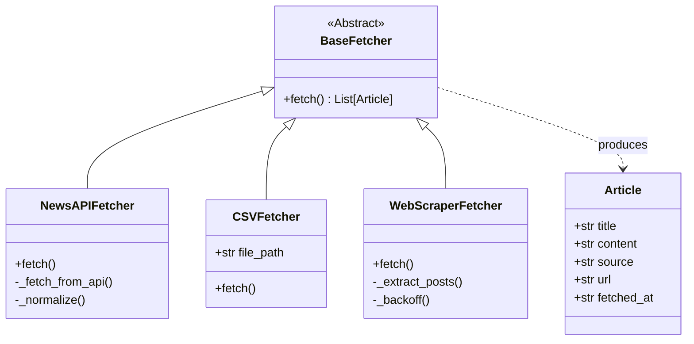

# System Design Document: Multi-Source Data Ingestion

## 1. High-Level Architecture
The system follows an **ETL (Extract, Transform, Load)** pipeline approach, orchestrated asynchronously.

### Data Flow Diagram
```mermaid
graph TD
    User([User / Scheduler]) -->|Starts| Main[main.py Orchestrator]
    
    subgraph Data Sources
        NewsAPI[External REST API]
        CSV[Local File System]
        Web[Website / HTML]
    end

    subgraph Fetcher Layer [Strategy Pattern]
        NewsF[NewsAPIFetcher]
        CSVF[CSVFetcher]
        WebF[WebScraperFetcher]
    end

    subgraph Core Logic
        Base[BaseFetcher Abstract Class]
        Model[Article Dataclass]
    end

    Main -->|Async Call| NewsF
    Main -->|Async Call| CSVF
    Main -->|Async Call| WebF

    NewsF -.->|Inherits| Base
    CSVF -.->|Inherits| Base
    WebF -.->|Inherits| Base

    NewsF -->|HTTP GET| NewsAPI
    CSVF -->|File I/O| CSV
    WebF -->|HTTP GET + Parse| Web

    NewsF -->|Returns List[Article]| Main
    CSVF -->|Returns List[Article]| Main
    WebF -->|Returns List[Article]| Main

    Main -->|Aggregates| JSON[Final JSON Output]
```

## 2. Class Design (Strategy Pattern)
The system uses the Strategy Design Pattern via an Abstract Base Class. This ensures that the main pipeline doesn't need to know the details of how data is fetched, only that it will be fetched.

Class Diagram

## 3. Key Technical Decisions
### A. Asynchronous I/O (AsyncIO & HTTPX)
* **Problem:** The pipeline fetches data from network sources (API, Web) and local disk. Synchronous execution would block the CPU while waiting for I/O, leading to poor performance.

* **Decision:** Used asyncio with httpx (async HTTP client) and aiofiles (async file I/O).

* **Impact:** Requests run concurrently. The total time taken is roughly equal to the slowest request, not the sum of all requests.

### B. Type Safety & Data Modeling
* **Problem:** Passing raw dictionaries leads to "key errors" and inconsistent data structures across different sources.

* **Decision:** Used Python dataclasses (Article class) to enforce a strict schema.

* **Impact:** Guarantees that every fetcher returns data in the exact same format (Normalization).

### C. Resilience Strategy
* **NewsAPI:** Implemented Exponential Backoff retry logic to handle transient network failures or rate limits.

* **Web Scraper:** Implemented Fallback Selectors. If the primary HTML tag (h3.post-title) is missing (due to site updates), the scraper automatically attempts to find data using a secondary selector [...]

## 4. Future Scalability (Adding a 4th Source)
The architecture is designed for "Open/Closed Principle" (Open for extension, closed for modification).

**Scenario: Adding a Twitter/X Fetcher.**

* Create fetchers/twitter.py.

* Define class TwitterFetcher(BaseFetcher).

* Implement the async def fetch(self) method to return List[Article].

* Add TwitterFetcher() to the sources list in main.py.